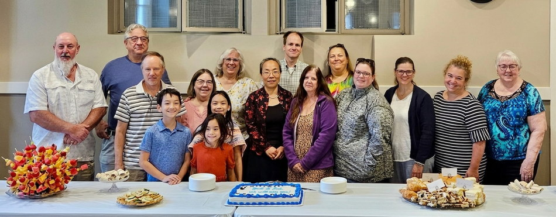

Music has been part of my life for as long as statistics has. For three
decades I have served congregations as a pianist, organist, choir
director, and music director — most recently as **Director of Music** at
[Trinity Evangelical Lutheran Church in Lemoyne,
Pennsylvania](https://www.trinitylemoyne.org), where I planned and led the
music for weekly worship, selected hymns and service music aligned with
the lectionary, directed the choir and handbells, and accompanied
congregational song from the organ and piano. That tenure concluded on
**August 23, 2026**.

## Most Recent Position

::: {.music-card}
**<i class="fa-solid fa-church" aria-hidden="true"></i> Director of Music** 
**Trinity Evangelical Lutheran Church** · Lemoyne, PA 
September 2025 – August 2026

- Organist and pianist for weekly Sunday worship and seasonal services
- Hymn selection aligned with the *Revised Common Lectionary*
- Direction of the adult vocal choir, the youth choir, and the handbell ensemble
- Preparation of service bulletins, calendars, music listings, and custom score engravings in [MuseScore](https://musescore.org/)
:::

I stepped down at the end of August 2026 to begin a musical sabbatical —
making room for research travel and other pursuits while keeping the
keyboard close at hand. It was a joy to make music with this congregation
week by week, and I am deeply grateful for the season.

::: {.photo-figure}
<figure>

<figcaption>The congregation gathered for a farewell reception after my final service at Trinity, August 23, 2026.</figcaption>
</figure>
:::

## The 2025–26 Music Calendar

::: {.calendar-teaser}
[<i class="fa-solid fa-calendar-days" aria-hidden="true"></i> **Open the 2025–26 Music Calendar** →](./music-calendar.html){.calendar-teaser-cta}

A complete record of the special music offered for each service of the
2025–26 lectionary year at Trinity, with brief notes on how each piece
connects to the theme of the day — and a playlist of the whole year.
:::

## Background

I was baptized at Our Redeemer Lutheran Church in Greenville, North
Carolina, and confirmed at Good Shepherd Lutheran Church in Raleigh,
North Carolina — both congregations of the Evangelical Lutheran Church
in America (ELCA).

I began playing piano for worship services in 1994 as the pianist for the
early service at Our Saviour's Lutheran Church in Long Beach, California,
and have been regularly involved in music ministry ever since — serving
in various roles as pianist, organist, choir director, and music director
at the congregations listed below.

## Positions Held

::: {.table-scroll role="region" aria-label="Positions held"}
| Years | Role | Congregation |
|-------|------|--------------|
| 2025/09 – 2026/08 | Director of Music | Trinity Evangelical Lutheran, Lemoyne, PA |
| 2025/01 – 2025/09 | Organist & Pianist | St. Peter's Lutheran, Highspire, PA |
| 2025/01 – 2025/05 | Organist & Pianist | Salem Lutheran, Oberlin, PA |
| 2020 – 2024 | Organist & Pianist | Renewed in Grace Co-Op (Trinity Lutheran, Steelton & St. Peter's, Highspire, PA) |
| 2018 – 2020 | Choir Director, Organist & Pianist | Trinity Lutheran, Steelton, PA |
| 2015 – 2018 | Pianist | Paxton Church of the Brethren, Harrisburg, PA |
| 1994 – 1998 | Pianist | Our Saviour's Lutheran, Long Beach, CA |
:::
